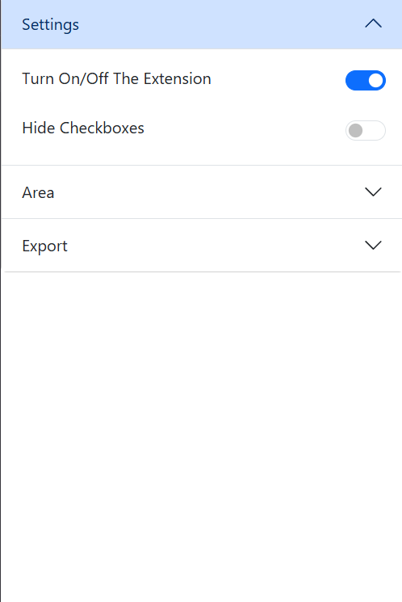
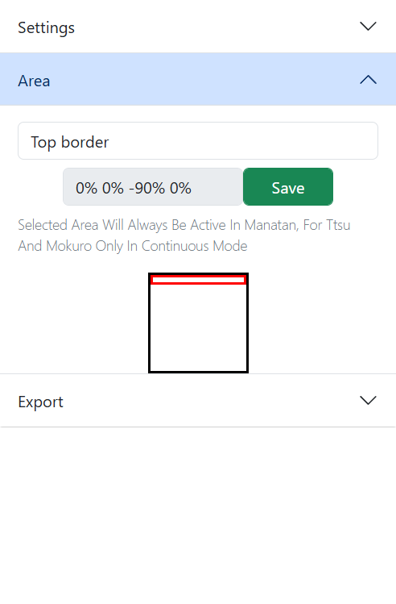
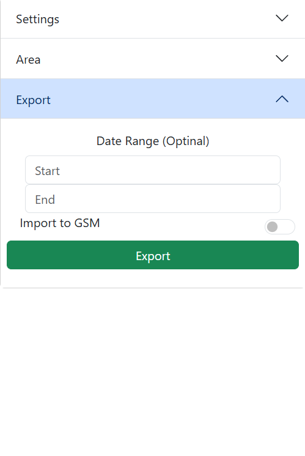
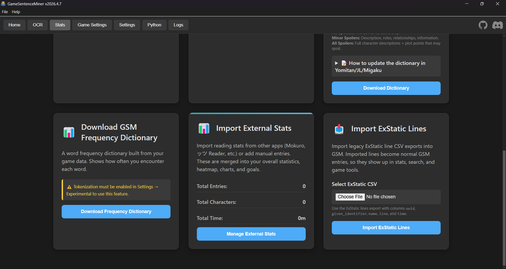

  # Reader2GSM
Browser Extension to track and Store text in supported readers for [GSM](https://github.com/bpwhelan/GameSentenceMiner)'s stats

Reader2GSM is a browser extension to track text lines read in supported readers, also allows exporting the data as CSV to be imported to GSM for stats. 

|Settings|Position|Export|
|--------|--------|------|
| | | |

## Supported Readers:
1- [ッツ Ebook Reader](https://github.com/ttu-ttu/ebook-reader), [kampr's fork](https://github.com/kamperemu/ebook-reader) and [ヤツ Reader](https://app.yatsu.moe/)

2- [Manatan](https://manatan.com/)'s Manga Reader

3- [Mokuro Reader](https://github.com/Gnathonic/mokuro-reader) (currently only in Develop branch)

## installtion from source:
- Chrome

  1- Clone the repository or download the ZIP and extract it.

  2- Open your browser and navigate to `chrome://extensions`. Toggle Developer mode.

  3- Click the Load unpacked button and select the `extension` folder from your extracted files.

- Firefox

  1- Clone the repository or download the ZIP and extract it.

  2- Ensure you have web-ext installed. If not, install it via npm: `npm install --global web-ext`.

  3- Navigate to the extension folder in your terminal and run: `web-ext build`.

  4- install:
    
    - Open Firefox and go to `about:addons`.
    - Click the gear icon (⚙️) and select Install Add-on From File...
    - Select the `.zip` file generated in the `web-ext-artifacts` folder.

## import CSV file to GSM:
- open GSM.
- Stats tab -> Tools -> Import ExStatic Lines -> Select your CSV file and press import.

